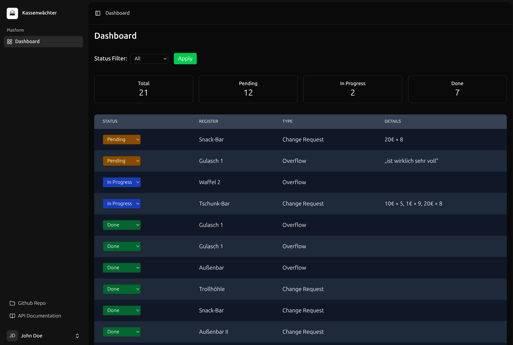
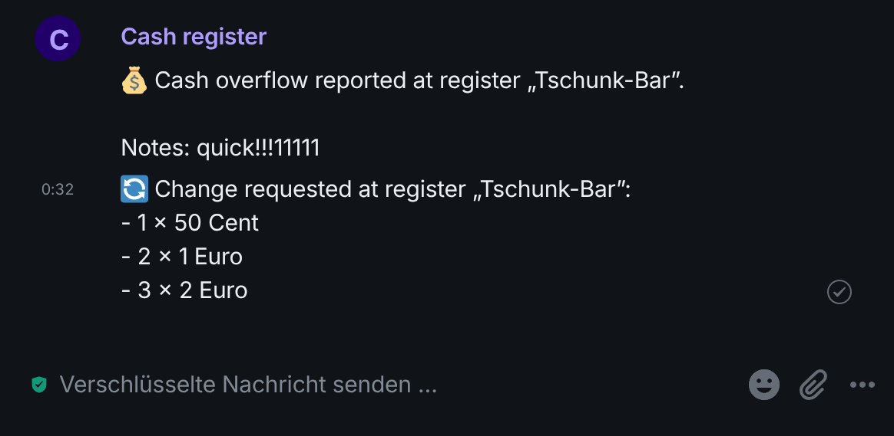
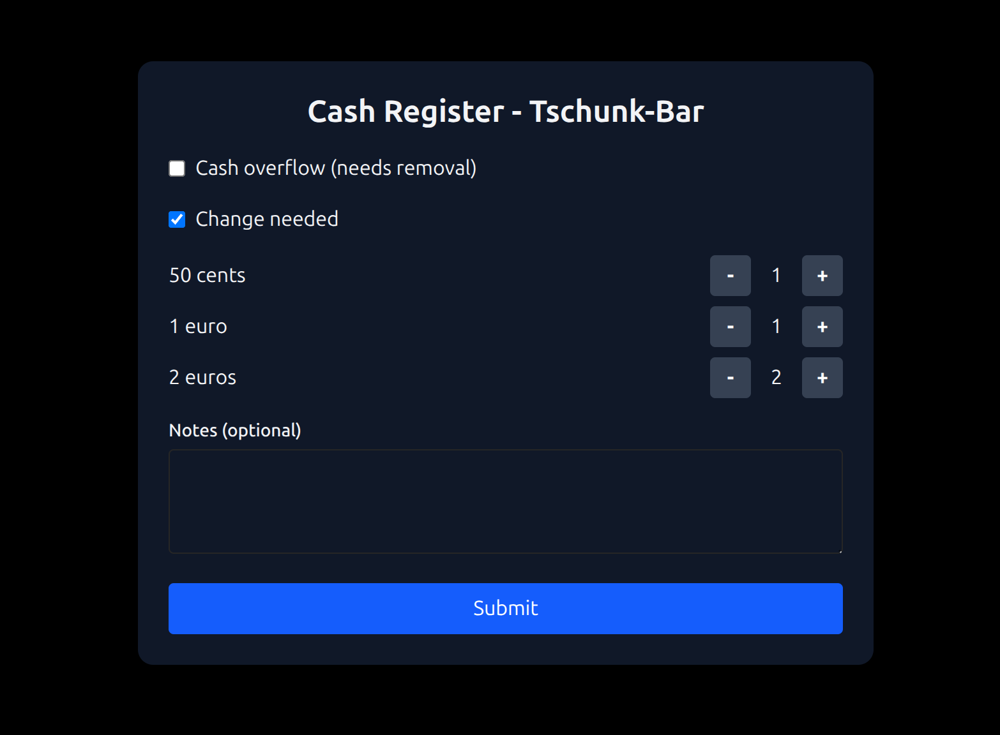

# wechselstu.be

A simple system to help bar and kitchen staff request actions with cash registers.
By scanning a QR code, staff can report when a register needs change or when it contains too much cash and needs to be
collected.

<table>
  <tr>
    <td align="center">
      
       
      <strong>Admin Dashboard</strong>
    </td>
    <td align="center">
      
       
      <strong>Matrix Notification</strong>
    </td>
    <td align="center">
      
       
      <strong>Public Interface</strong>
    </td>
  </tr>
</table>

## Features

- **Token-protected links**: Each cash register has a unique, token-protected URL.
- **Overflow reporting**: Notify admins when a register contains too much cash and needs to be collected.
- **Change request**: Request specific quantities of coins (by denomination) for change.
- **Admin dashboard**: View all work orders and update their status (In Progress, Completed).

## API

| Method | Endpoint                             | Description                                |
|--------|--------------------------------------|--------------------------------------------|
| POST   | `/api/registers/{token}/work-orders` | Report register overflow or request change |
| GET    | `/api/work-orders`                   | List all work orders (Admin)               |
| GET    | `/api/work-orders/count`             | Count all work orders (Admin)              |
| PUT    | `/api/work-orders/{id}`              | Update a work order (Admin)                |
