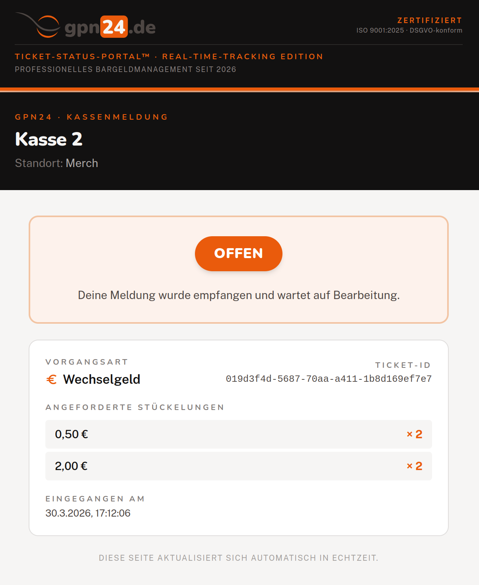
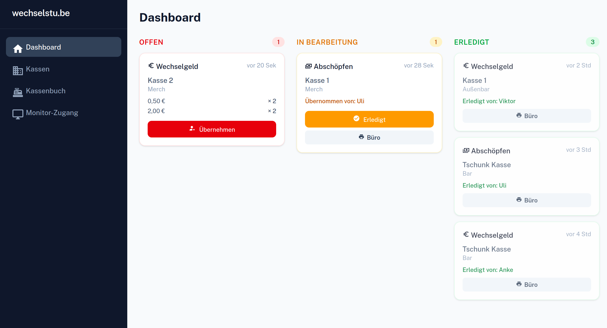
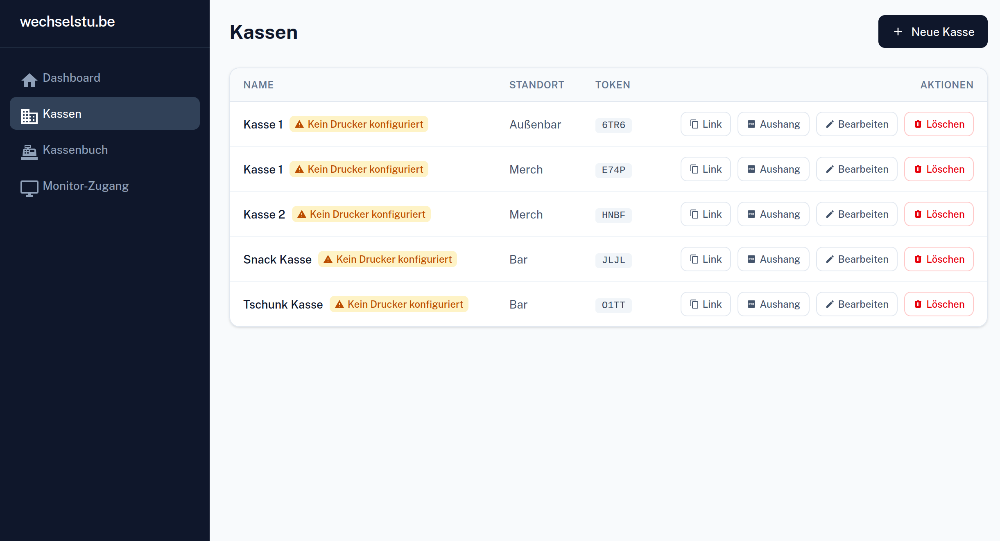

# wechselstu.be

A simple system to help finance teams manage cash registers at events like the Gulaschprogrammiernacht.
By scanning a QR code, staff can report when a register is full or request change, without logging in.
The finance team handles requests in a real-time dashboard.

## Screenshots

|                                        |                                        |
|----------------------------------------|----------------------------------------|
|  |  |
|     |      |

## Features

- **QR code access**: Each register has a unique token-protected URL, no login required.
- **Ticket types**: Report cash overflow, request change (by denomination), or send a general message.
- **Real-time dashboard**: Finance team sees and manages tickets live via WebSockets.
- **Read-only monitor**: Fullscreen display view for Raspberry Pi / info screens, token-protected.
- **Notifications**: Optional Matrix message and EPSON ePOS print on ticket creation.

## Setup

**Requirements:** PHP >= 8.3, Composer, Node.js >= 20

```bash
git clone <repo>
cd wechselstu.be
composer setup
```

`composer setup` handles everything: install dependencies, create `.env`, generate key, run migrations, build frontend.

Afterwards, adjust `.env` as needed (see configuration below).

### Development

```bash
composer dev
```

Starts Laravel, queue worker, Pail log viewer, Vite dev server and Reverb WebSocket server concurrently.

- App: http://localhost:8000
- WebSocket: ws://localhost:8080

Seed test data:

```bash
php artisan db:seed
```

Creates user `dev@dev.de` / `password` and 5 test registers.

### Domain routing

Each domain maps to a ticket type. The type is detected automatically from the domain the user opens:

```env
DOMAIN_CASH_FULL=kassevoll.example.com
DOMAIN_CHANGE_REQUEST=wechselgeld.example.com
DOMAIN_OTHER=meldung.example.com
```

Locally, pass the type as a query parameter instead:

```
http://localhost:8000/s/{token}?type=cash_full
http://localhost:8000/s/{token}?type=change_request
http://localhost:8000/s/{token}?type=other
```
